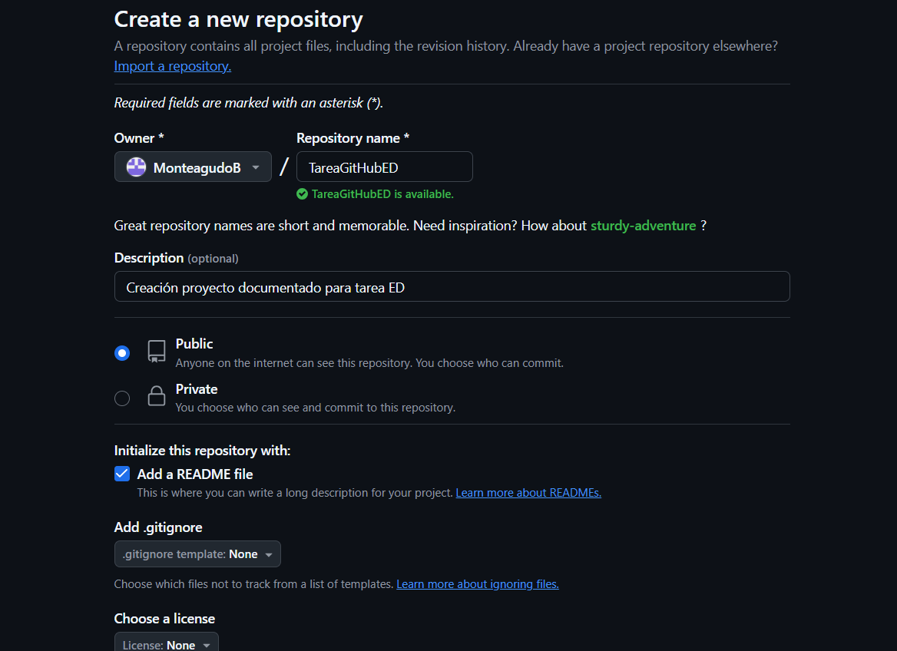

# TareaGitHubED
Creación proyecto documentado para tarea ED

## Instalación de Git Windows
Para la instalación de Git en Windows, he usado el comando **winget install git.git** a través del terminal. Una vez instalado he creado cuenta en GitHub donde he creado un nuevo repositorio llamado TareaGitHubED seleccionando la casilla para que cree directamente un archivo markdown **ReadMe**,(ver siguiente imagen) en donde estoy realizando la tarea.

Tras esto he comprobado con **git --version** si estaba correctamente instalado. Para acabar la configuración en el equipo he modificado el path para la direccion de *git/bin* porque se incluye *git.exe* en esa carpeta y en *git/cmd*.

### Creación carpeta imagenes en Github
Tras el proceso anterior, he clonado en local el directorio a través de la terminal. Me he situado en donde quería "descargar" el rep con cd y usado el comando **git clone y la dirección https**.
Ya descargado en local el *rep* he creado la carpeta y añadido la captura de modo más cómodo a la carpeta images, y subido al **main branch** mediante la terminal con el comando **git push origin main** (nombre de la rama principal).

#### Finalización
Modificando el ReadMe para acabar la tarea, e intentar dejarlo presentable, cumpliendo así los objetivos propuestos en la tarea, con múltiples commits de tanto probar y modificar para aprender de **Git** y **GitHub**.
